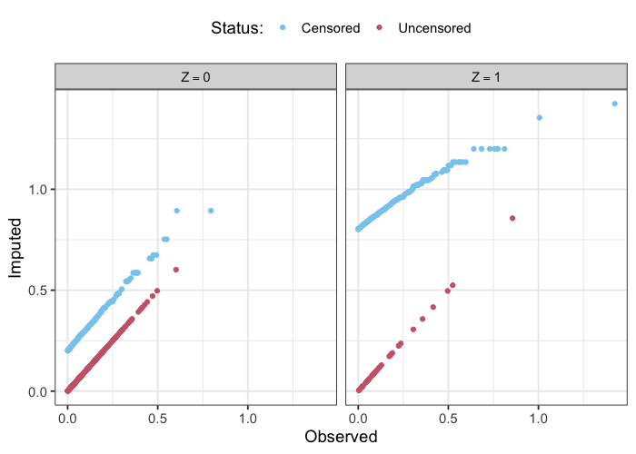
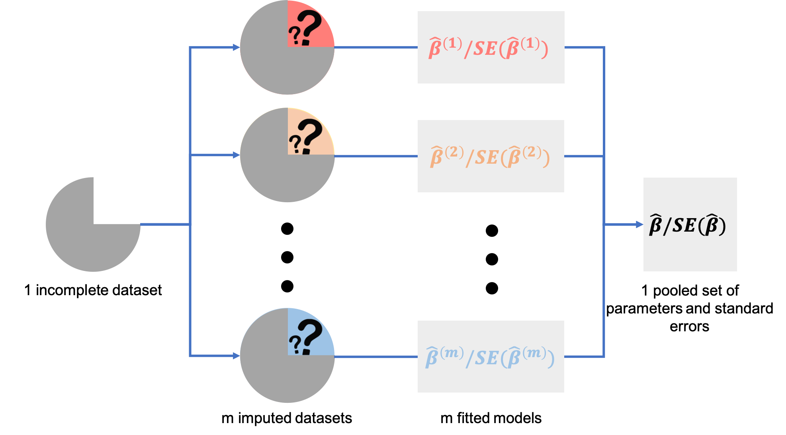

# Correcting conditional mean imputation for censored covariates and improving usability
## Lotspeich, Grosser & Garcia 
### Statistical methods to impute censored covariates. 

# Repo Organization 

- bash_scripts: Bash scripts used to run R simulations on cluster
- R_code: contains R code for
	- markdowns: RMD files used to show results from simulations
	- simulations: R scripts to run simulations of censored covariate imputation
	- source: functions used in simulations
- Simulation_results: contain RDS files created by simulations

# Installation 

The `R` package `imputeCensoRd` which implements statistical methods to impute censored covariates can be installed using the `devtools` package in `R` as follows. 

```{r}
devtools::install_github(repo = "kylefred/Imputing-Censored-Covariates", subdir = "imputeCensoRd")
library(imputeCensoRd)
```

# Example
## Simulate Data


```{r}
set.seed(114)

# Set parameters 
N <- 1000
lambda <- -2
beta0 <- 1
beta1 <- 1
beta2 <- 0.25

# Simulate data
z <- rbinom(n = N, size = 1, prob = 0.25)
```

There is a built-in function, `imputeCensoRd::cox_simulation()` which generates the covariate X as described. It takes in the following parameters and is implemented for our simulation in the code chunk below: 

- `n`: sample size
- `logHR`: log hazard ratio coefficients for linear predictor of Cox model 
- `A`: matrix of auxiliary covariates for linear predictor of Cox model
- `dist`: desired distribution, with choices `"Exponential"`, `"Weibull"`, or `"Gompertz"`. Default is `"Exponential"`.
- `lambda`: (KYLE WILL FILL IN FOR SARAH PLEASE). Default is `1`.
- `nu`: (KYLE WILL FILL IN FOR SARAH PLEASE). Default is `NULL`.
- `alpha`: (KYLE WILL FILL IN FOR SARAH PLEASE). Default is `NULL`.

```{r}
x <- imputeCensoRd::cox_simulation(n = N, logHR = lambda, covariate = matrix(z, ncol = 1), dist = "Exponential", lambda = 5)
e <- rnorm(n = N, mean = 0, sd = 1)
y <- beta0 + beta1 * x + beta2 * z + e
c <- rexp(n = N, rate = 4)
delta <- as.numeric(x <= c)
t <- pmin(x, c)
x[delta == 0] <- NA
sim_dat <- data.frame(y, x, t, z, delta)
```

## Single Imputation

The function `imputeCensoRd::condl_mean_impute()` imputes censored covariates with their conditional mean given censored value and additional covariates (where supplied). This is conditional mean single imputation. We can use it to impute censored `x` in the simulated data and then fit the model for `y ~ x + z` to the imputed dataset. This function takes in the following parameters: 

- `fit`: A `coxph` or `survfit` imputation model object (from the `survival` package).
- `obs`: String column name for the censored covariate.
- `event`: String column name for the censoring indicator of the covariate.
- `addl_covar`: (Optional) string or vector of strings for the additional fully-observed covariates. Default is `NULL`.
- `data`: Datafrane containing columns `obs`, `event`, and (if provided) `addl_covar`.
- `approx_beyond`: Choice of approximation used to extrapolate the survival function beyond the last observed event time. Default is `"expo"` for the exponential approximation from Brown, Hollander, and Kowar (1974). Other choices include `"zero"`, which immediately goes to zero (Efron, 1967), or `"carryforward"`, which carries forward the survival at last event time (Gill, 1980).

```{r}
# Fit the imputation model for x ~ z 
imp_mod <- survival::coxph(formula = survival::Surv(time = t, event = delta) ~ z, data = sim_dat)
# Impute censored x in sim_dat
sim_dat_imp <- imputeCensoRd::condl_mean_impute(fit = imp_mod, obs = "t", event = "delta", addl_covar = "z", data = sim_dat, approx_beyond = "expo")
```

The single imputation values are illustrated below, where the x-axis is the observed value `t` and the y-axis is the imputed value. Note: for uncensored subjects, there is no need for imputation so observed and imputed are the same. 


*Illustration of conditional mean single imputation values for a censored covariate.*

With the imputed dataset, `sim_dat_imp`, we can now fit the desired analysis model. Since outcome `y` is continuous, we fit a normal linear regression model with covariates `imp` (in place of `x`) and `z`. 

```{r}
mod <- glm(formula = y ~ imp + z, data = sim_dat_imp, family = "gaussian")
```

```{r}
Call:  glm(formula = y ~ imp + z, family = "gaussian", data = sim_dat_imp)

Coefficients:
(Intercept)          imp            z  
     0.8448       1.7176       0.5007  

Degrees of Freedom: 999 Total (i.e. Null);  997 Residual
Null Deviance:	    2211 
Residual Deviance: 1624 	AIC: 3331
```

While they might offer bias corrections, single imputation approaches like this are known to underestimate the variability due to the imputed values (since they are treated with the same certainty as the actual observed `x` values). This means that statistical inference based on single imputation will be invalid, so we instead turn to the following multiple imputation approach to correct for this. 

## Multiple Imputation 

Instead of imputing censored variables just once, multiple imputation approaches iteratively repeat the (1) imputation and (2) analysis steps many times, and ultimately pool these analyses into one set of parameters which are expected to be unbiased and with appropriate variability estimates. This process is briefly illustrated in the following diagram. 


*This figure was adapted from Figure 1.6. in Buuren, S. (2012). Flexible imputation of missing data. Boca Raton, FL: CRC Press.*

The function `imputeCensoRd::condl_mean_impute_bootstrap()` imputes censored covariates with their conditional mean given censored value and additional covariates (where supplied) using bootstrap resamples from the supplied dataset. This is conditional mean multiple imputation. We can use it to impute censored `x` in the simulated data and then fit the model for `y ~ x + z` to the imputed dataset. This function takes in the following parameters: 

- `obs`: String column name for the censored covariate.
- `event`: String column name for the censoring indicator of the covariate.
- `addl_covar`: (Optional) string or vector of strings for the additional fully-observed covariates. Default is `NULL`.
- `data`: Datafrane containing columns `obs`, `event`, and (if provided) `addl_covar`.
- `approx_beyond`: Choice of approximation used to extrapolate the survival function beyond the last observed event time. Default is `"expo"` for the exponential approximation from Brown, Hollander, and Kowar (1974). Other choices include `"zero"`, which immediately goes to zero (Efron, 1967), or `"carryforward"`, which carries forward the survival at last event time (Gill, 1980).
- `M`: an integer number of bootstrap samples to be taken from `data`.

# References

Bender, R., Augustin, T., and Blettner, M. (2005). Generating survival times to simulate Cox proportional hazards models. *Statistics in Medicine*, 24:1713–1723.

Brown, J. B. W., Hollander, M., and Korwar, R. M. (1974) Nonparametric Tests of Independence for Censored Data, with Applications to Heart Transplant Studies. *Reliability and Biometry: Statistical Analysis of Lifelength*, F. Proschan and R.
J. Serfling, eds. Philadelphia: SIAM, pp. 327-354.

Efron, B. (1967) The Two Sample Problem with Censored Data. *Proceedings of the Fifth Berkeley Symposium On Mathematical Statistics and Probability.* New
York: Prentice-Hall, 4:831-853.

Gill, R.D. (1980) Censoring and Stochastic Integrals. *Mathematical Centre Tracts*. Amsterdam: Mathematisch Centrum, 124.
